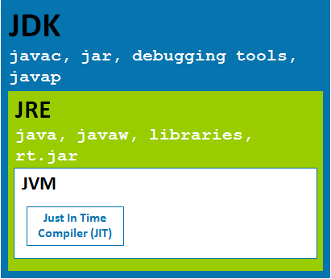

# Java Basics

Java is a popular object-oriented programming language. Here are some key topics:

- ### 1. JDK, JRE, JVM?

JDK: Java Development Kit, which is an environment to develop, compile and run java application.

JRE: Java Runtime Environment, which is an environment to run java applications.

JVM: Java Virtual Machine, which is an interpreter to execute java programs (byte code, .class file, or .jar file) line by line.

Relationship: 

- Classes and Objects
- Inheritance
- Polymorphism
- Interfaces
